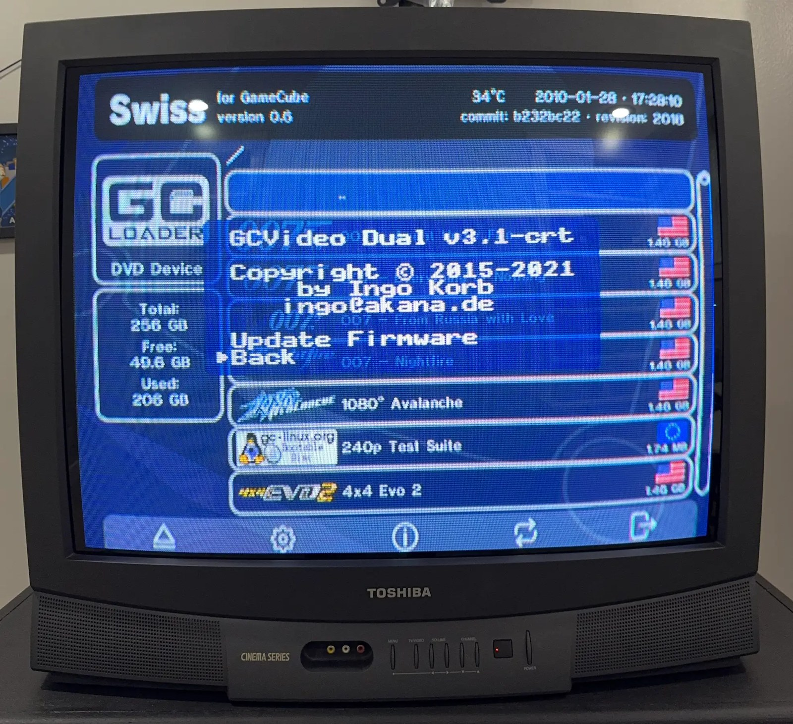

# GCVideo 3.1 for the Carby Component cable

> [!NOTICE]
> **Release withdrawn.** We discovered a banding issue with the current firmware. The release has been pulled while we correct it, and a new release will follow. Please don't flash the current build in the meantime.

## What this is

This is a GCVideo 3.1 firmware build for the Insurrection Industries Carby Component cable: the analog YPbPr version, with a board marked "GCAnalog 1.9". The repository also holds a backup of the original firmware, the full FPGA pin map, the build source, and a step-by-step [flashing guide (PDF)](docs/carby-component-gcvideo-3.1-flashing-guide.pdf).

The firmware and the flashing guide will be posted on the [Releases page](https://github.com/jeff-strutb/carbygcvideo/releases) once the corrected build is ready.

## Background

The Carby Component plugs into the GameCube's Digital AV port. It takes the console's digital video and turns it into analog component video (YPbPr, the red, green, and blue plugs on most TVs) using the open-source [GCVideo](https://github.com/ikorb/gcvideo) project. GCVideo runs on an FPGA, a chip whose logic is loaded from a small flash memory chip each time it powers on.

The cable shipped with a customized GCVideo 2.4d build. GC-Forever's Game Boy Interface wiki lists it as "Insurrection Industries CARBY v2.4d-2".

It could not be updated the normal way:

- GCVideo's in-console updater only exists in version 3.0 and later, so the stock firmware has no update path.
- Upstream GCVideo has no build for this board. Its closest relative, GCDual, uses different FPGA pins for nearly every video signal, so a stock GCDual image gives a black screen.
- The "Carby 3.1" firmware Insurrection published is the GCVideo Shuriken v3 build (hardware ID SH3G) for the HDMI Carby. It is not for the Component cable.

| Part | Details |
| --- | --- |
| FPGA | Xilinx Spartan-3A XC3S200A-4VQG100C |
| Video DAC (digital-to-analog converter) | Analog Devices ADV7125KST50, triple 8-bit |
| SPI flash (stores the firmware) | Macronix MX25L4005, 4 Mbit (512 KB) |
| Output | Analog YPbPr |
| Extras | IR receiver (U7) and button (BU1) on the board |
| Programming header | J1: +3.3V, GND, MOSI, CLK, MISO, CS |

More detail with photos: [docs/hardware.md](docs/hardware.md), [docs/pinout.md](docs/pinout.md), [docs/technical-notes.md](docs/technical-notes.md).

## Why upgrade to 3.1

- **Chroma interpolation can be turned off** (Advanced Settings). Color in this video signal is sent at half the horizontal resolution, and GCVideo 2.4d-2 and earlier always blend (interpolate) the color samples. Nintendo's own component cable repeats each color sample instead, and Game Boy Interface High-Fidelity edition gives the most accurate color edges with interpolation off.
- **Better handling of homebrew and unusual video modes**: non-standard mode detection with automatic processing bypass (3.0).
- **Automatic image centering**, with an optional image shift (3.0).
- **A workaround for the analog component output signal range** (3.0).
- **An advanced options menu** for turning off individual processing steps, and **faster startup** (3.0).
- **A menu entry to set up IR remote buttons** (3.0e).
- **Less screen blanking during menu transitions** in some games, for example Eternal Darkness (3.1).
- **486-to-480 line cropping for Game Boy Interface** (3.1).
- **CRT-friendly defaults**: this build ships with the line doubler off, and with full source, so future GCVideo releases can be built for this cable.

Sources: [GCVideo releases and changelog](https://github.com/ikorb/gcvideo/releases); GC-Forever wiki, [Game Boy Interface High-Fidelity Edition](https://www.gc-forever.com/wiki/index.php?title=Game_Boy_Interface%2FHigh-Fidelity_Edition) and [Game Boy Interface Standard Edition](https://www.gc-forever.com/wiki/index.php?title=Game_Boy_Interface%2FStandard_Edition); Extrems on GCVideo chroma upsampling in the shmups.system11.org thread ["Cloning the Gamecube component cable"](https://shmups.system11.org/viewtopic.php?f=6&t=51450&start=1800).

### Known limitations

- **No controller button combo for the menu.** The Digital AV port does not carry the controller signal, so no plug-in cable can read the controller. The original firmware cannot either (tested). Open the menu with an IR remote that uses the NEC protocol, set up by holding BU1.
- **Future updates need the same SPI flasher.** This build is flashed as a single main image, without GCVideo's in-console update stage.
- **480p passes through unchanged**, so it only shows on a screen that accepts 480p. On a standard-definition CRT, set games and Game Boy Interface to 240p or 480i.
- **Six of the 24 color bits were placed by inference** rather than direct measurement (brightness bits 0 to 3 and red-difference bits 0 and 1). Test patterns show no visible error. Details in [docs/technical-notes.md](docs/technical-notes.md).
- **Do not run GCVideo's official console updater** on this cable. This build keeps GCDual's hardware ID, so the updater could install the stock GCDual image and give a black screen. See [src/README.md](src/README.md).

## How to upgrade

The [flashing guide (PDF)](docs/carby-component-gcvideo-3.1-flashing-guide.pdf) has the full walkthrough with photos.

**What you need:** an FT232H USB board (a CJMCU FT232H was used here), six female jumper wires, a computer that can run Python with [pyftdi](https://github.com/eblot/pyftdi) (Linux, or Windows with WSL2 and usbipd-win), the GameCube, and the cable.

**Steps:**

1. Back up your current firmware with `src/flasher/dump.py`.
2. Wire the FT232H to the J1 header.
3. Hold the FPGA in reset by touching a wire to FPGA pin 100 during each flash step.
4. Flash `firmware/gcvideo/carby_gcvideo31_final.bin` with `src/flasher/flashbin.py`.
5. Wait for the verify message.
6. Disconnect the FT232H and power-cycle the console.

**Going back:** flash `firmware/original/carby_backup.bin` with `src/flasher/restore.py`.

This means opening the cable's plug housing and fine-pitch work next to the FPGA. Do it at your own risk.

## Credits and license

GCVideo is by Ingo Korb ([ikorb](https://github.com/ikorb/gcvideo)). Game Boy Interface and the chroma research are by Extrems. Thanks to the GC-Forever and shmups.system11.org communities for the documentation and testing this work relies on. The firmware and source here are distributed under GCVideo's license, a BSD-style 2-clause license; see [LICENSE](LICENSE).
