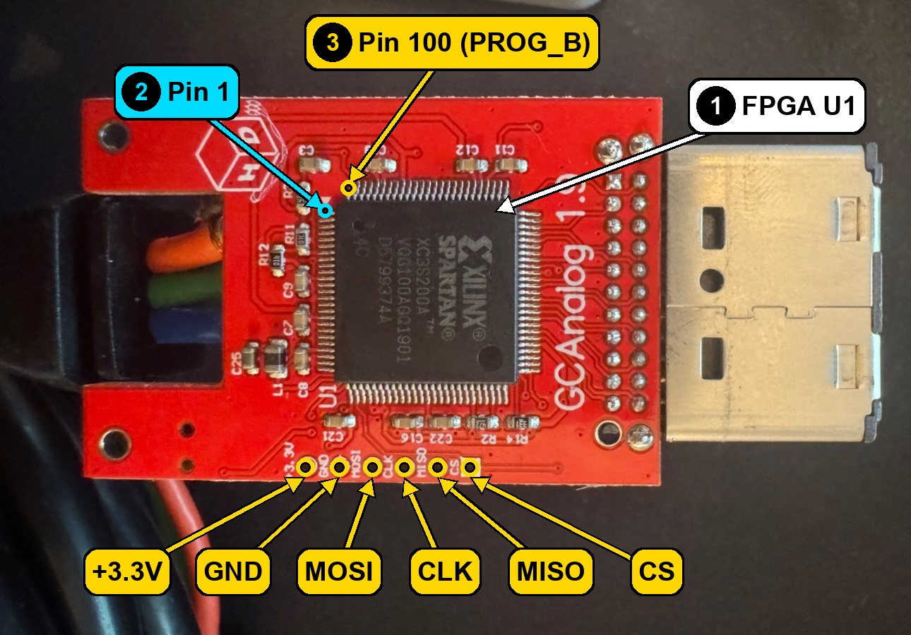
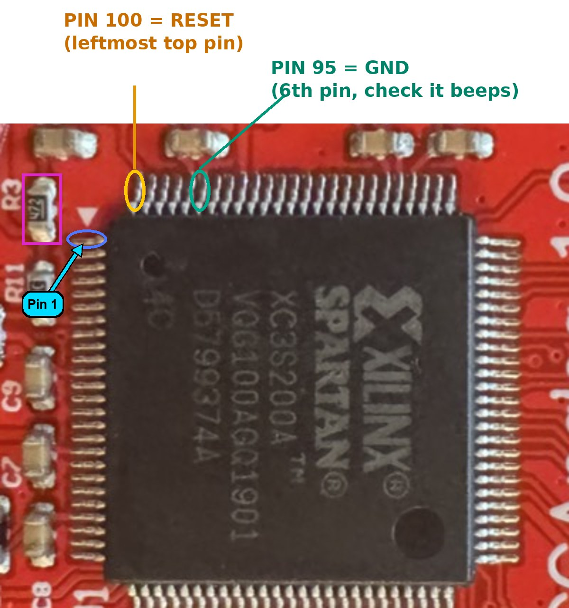
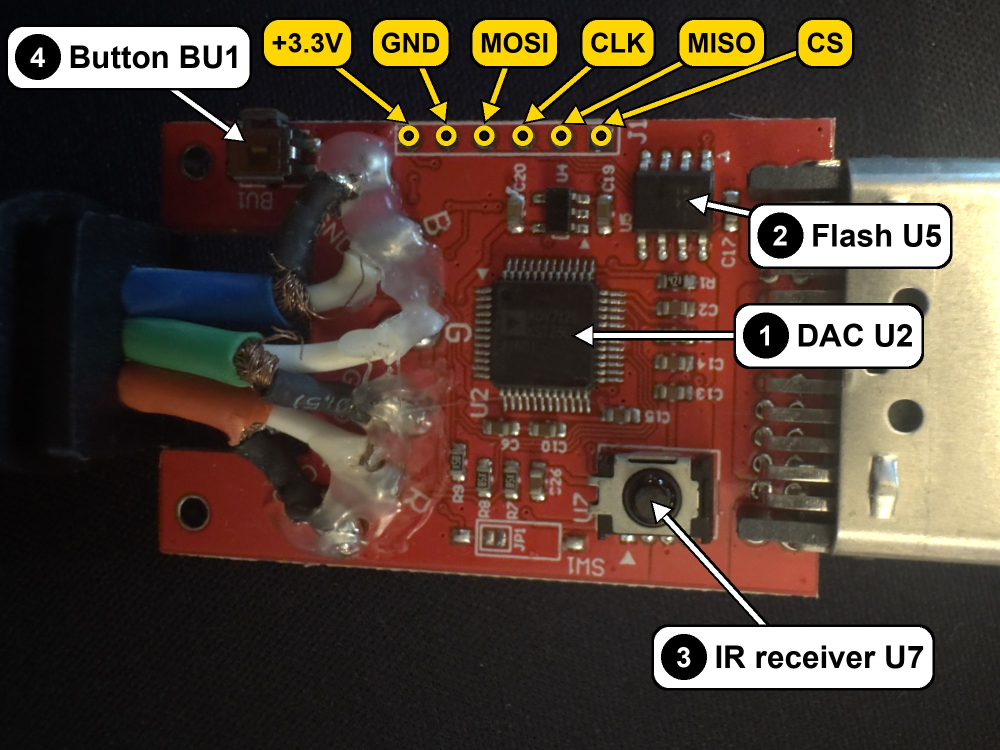

# Hardware

The Carby Component board is marked "GCAnalog 1.9". It plugs straight into the GameCube's Digital AV port, and the three component video wires (Y, Pb, Pr) are soldered to the far end of the board.

## Parts

| Ref | Part | Job |
| --- | --- | --- |
| U1 | Xilinx Spartan-3A XC3S200A-4VQG100C (FPGA, 100 pins) | Runs GCVideo. Reads the console's digital video and drives the DAC. |
| U2 | Analog Devices ADV7125KST50 (triple 8-bit video DAC) | Turns the FPGA's three 8-bit color values into analog voltages. |
| U5 | Macronix MX25L4005 (SPI flash, 4 Mbit, 512 KB) | Holds the firmware. The FPGA loads itself from here at power-on. |
| U7 | IR receiver | Receives the remote control used to open the GCVideo menu. |
| BU1 | Push button | Opens the IR remote setup screen (hold it). |
| J1 | 6-pin programming header | Gives direct access to the flash chip's SPI lines. |

## FPGA side

1. FPGA U1.
2. Pin 1 of the FPGA, next to the small triangle printed on the board. Pins are numbered counterclockwise from here.
3. Pin 100, the last pin, at the left end of the top row (in this view). Pin 100 is **PROG_B**, the FPGA's configuration reset. While it is held low, the FPGA lets go of the flash chip's wires, so the flasher can talk to the flash without a fight. This is the pin touched with the AD4 wire during every flash step.

The J1 header pads are printed with their names, from left to right in this view: +3.3V, GND, MOSI, CLK, MISO, CS. CS is the square pad.

A closer view of the pin 100 corner (the owner's own markup, with pin 1 added):

## DAC side

1. DAC U2.
2. SPI flash U5.
3. IR receiver U7.
4. Button BU1.

J1 runs along the top edge in this view. The pin names are printed only on the FPGA side. On this side they are in the same left-to-right order (+3.3V at the left, CS at the right), which matches the square CS pad at the right end on both sides.

## The flash chip

- JEDEC ID: `C2 20 13` (Macronix, 4 Mbit). `flashfull.py`, `flashbin.py` and `restore.py` check for this ID before writing anything.
- It shipped with its block-protect bits set: status register `0x1C`. With these bits set, erase and write commands are silently ignored. Nothing reports an error, the old firmware simply stays. `flashfull.py`, `flashbin.py` and `restore.py` write `0x00` to the status register before erasing, and `flashfull.py` and `flashbin.py` stop if the bits are still set afterward.

## Power

The board is powered by the GameCube through the Digital AV port. During flashing the console stays on and the FT232H's +3.3V is not connected to J1.

Pin assignments for every signal: [pinout.md](pinout.md).
