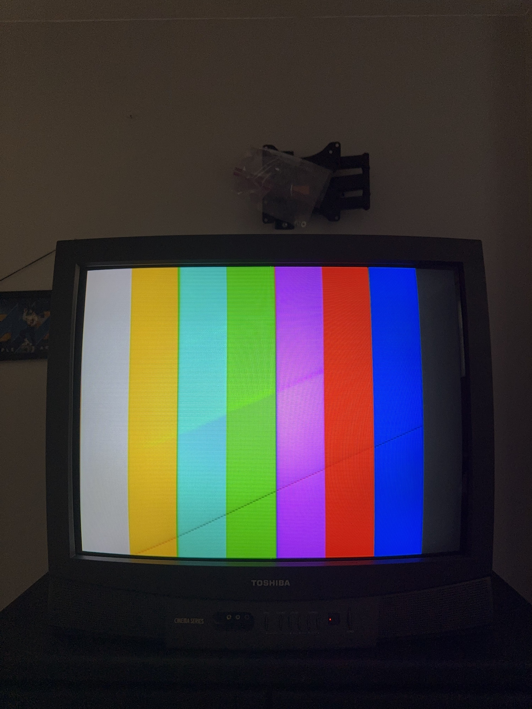
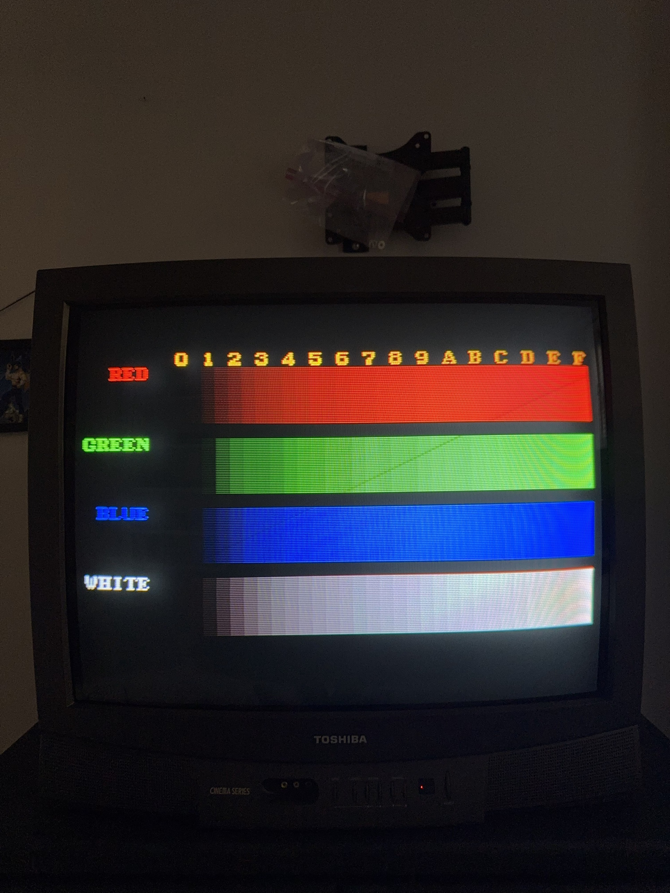

# Technical notes

What was learned while porting GCVideo 3.1 to the Carby Component, and how each fact was established. Pin numbers are FPGA pins (P1 to P100). The full map is in [pinout.md](pinout.md).

## 1. The stock firmware is not stock GCDual

The original firmware is a modified GCVideo 2.4d. GCDual is the closest upstream GCVideo board, but about 57% of the Carby image differs from GCDual 2.4d, and the console input pins differ too.

How: the backup ([firmware/original/carby_backup.bin](../firmware/original/carby_backup.bin)) was compared byte by byte against the GCDual 2.4d image. The input pins were then measured on the live board (see note 5 for the method).

## 2. The flash ships write-protected

The flash's status register reads `0x1C` out of the box. Those block-protect bits make the chip ignore erase and write commands without reporting an error, so a flasher appears to run and the old firmware stays.

How: reading the flash's status register (command `0x05`) returned `0x1C`. `flashfull.py`, `flashbin.py` and `restore.py` now write `0x00` to the status register before erasing, and `flashfull.py` and `flashbin.py` check that the bits cleared.

## 3. Insurrection's "Carby 3.1" download does not fit this board

The "Carby 3.1" firmware Insurrection published is the GCVideo Shuriken v3 build, hardware ID SH3G, made for the HDMI Carby. It is not built for the Component cable's pins.

How: GCVideo images carry a four-letter hardware ID. The download's ID is SH3G, which upstream GCVideo uses for the Shuriken v3 target.

## 4. Flash layout and update tool

The firmware is GCVideo's standard two-stage layout: the update tool at offset 0 with its tag at 0x2FFE8, and the main firmware at 0x30000. The hardware ID is `CBCG` (Carby Component), so GCVideo's update tool only accepts firmware built for this cable. The update tool opens from About, Update Firmware, or by holding BU1 (the IR config button) while powering on. It also starts on its own if the main firmware is missing or damaged, so a failed update can be recovered without the FT232H.

## 5. P70 is the DAC clock, not DAC power-save

Every early build held P70 high, believing it was the DAC's power-save input. In fact P70 is the DAC's clock input, so the DAC never saw a clock edge and the screen stayed black.

How: a test firmware (`diag4.py`) gave every FPGA output its own PWM signature, a different duty cycle per pin, so each pin settles at its own average voltage. Reading the voltage on the DAC's clock pin with a multimeter named the FPGA pin driving it.

## 6. Sync is on P15

The DAC's SYNC input is driven from P15.

How: found the same way as note 5, by reading the PWM signature on the DAC's SYNC pin. It was confirmed by measuring the composite sync voltage on that pin while the original firmware was running.

## 7. The color bits were mapped with the TV as the instrument

Rather than probing 24 tiny DAC pins, a test firmware (`diag7.py`) drew a grid of split boxes on the TV. The left half of each box shows a background color, and the right half shows the same background with one FPGA line flipped. Photos of the screen showed which color channel each line drives, and how strongly, which gives its bit position.

How: the background could be changed over the FT232H between photos, so weak low-order bits could be seen against a suitable background.

## 8. The four lowest Pb bits were first on the wrong pins

The first map put Pb (blue-difference) bits 0 to 3 on the wrong pins. The 240p Test Suite blue color ramp showed flat four-step plateaus instead of a smooth fade, the sign of low bits that are not doing their job. The pattern pointed to P9, P10, P12 and P13.

How: after moving those bits (`carby_pbfix.py`) the ramp is smooth.

## 9. Low brightness bits and gradient banding

The first build placed brightness bits 1 and 2 on two of the red-difference pins, so smooth gradients only received the top five brightness bits and showed contour banding. A dark-background photo test showed that P35 and P34 change brightness, not red. A meter test (diag9) then gave the five candidate pins widely spaced signature voltages and confirmed the final order: brightness bits 0 to 2 on P33, P34, P35 and red-difference bits 0 and 1 on P50, P49. A second meter test (diag10) confirmed blue-difference bits 0 to 3 on P13, P12, P10, P9. After the fix, gradients match a Retro-Bit Prism cable in the same scene.

## 10. The IR receiver and button were found by watching inputs

A test firmware (`diag8.py`) made every FPGA pin a pulled-up input and counted level changes on each. While it ran, the board's button was pressed and a remote was pointed at the cable. P82 changed with the remote (IR receiver U7) and P21 went low with the button (BU1, active low).

## 11. Menu access

The GCVideo menu opens with the IR remote. The controller button combination used by internal GCVideo installs cannot work on any cable that plugs into the Digital AV port, because that port does not carry the controller signal. Internal installs read it through an extra wire. The original Carby firmware does not respond to the combination either.

## 12. Video modes are the console's

GCVideo passes the console's video mode through. A 15 kHz CRT (a standard-definition TV) cannot show 480p, and a 480p signal on such a TV shows as diagonal or rolling garbage. Game Boy Player in 480i flickers strongly because of interlacing.

How: tested on a CRT. Launch Game Boy Player and Game Boy Interface in 240p from Swiss, and set games to 240p or 480i.
